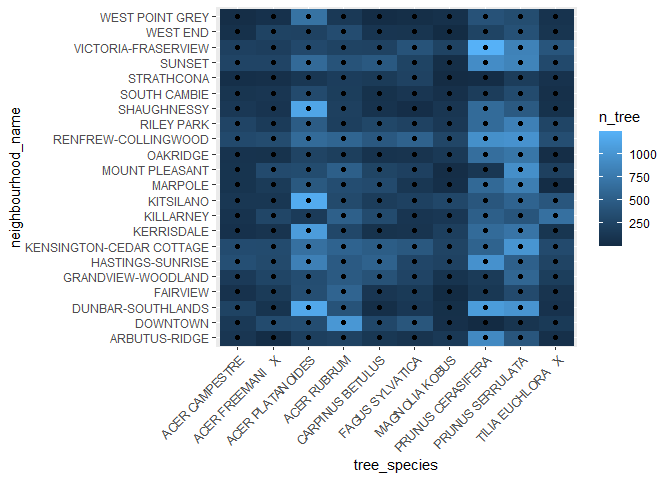
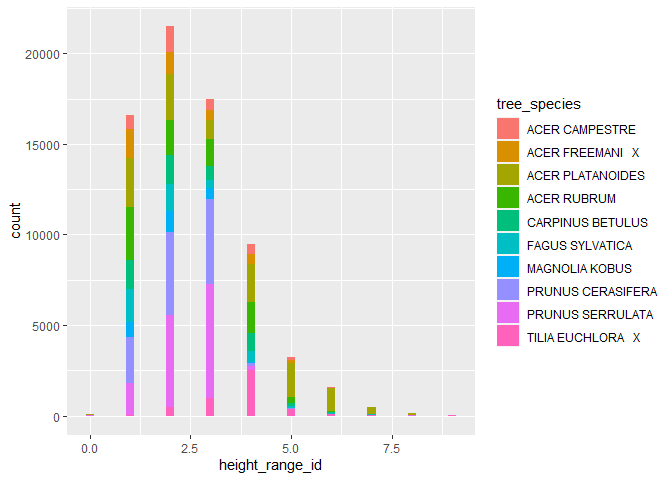
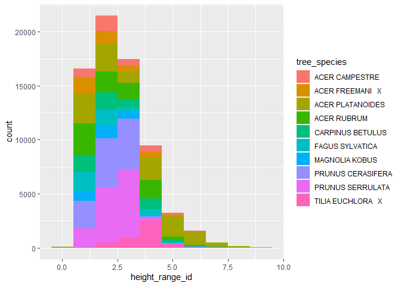
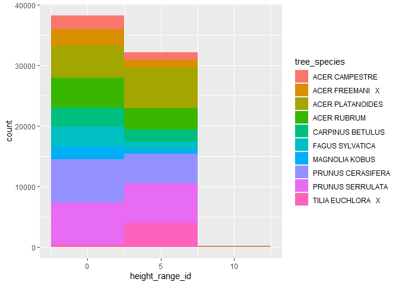
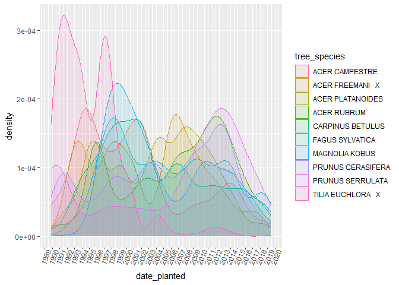
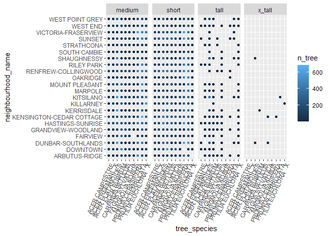

*To complete this milestone, you can either edit [this `.rmd` file](https://raw.githubusercontent.com/UBC-STAT/stat545.stat.ubc.ca/master/content/mini-project/mini-project-2.Rmd) directly. Fill in the sections that are commented out with `<!--- start your work here--->`. When you are done, make sure to knit to an `.md` file by changing the output in the YAML header to `github_document`, before submitting a tagged release on canvas.*

# Welcome to the rest of your mini data analysis project!

In Milestone 1, you explored your data. and came up with research questions. This time, we will finish up our mini data analysis and obtain results for your data by:

-   Making summary tables and graphs
-   Manipulating special data types in R: factors and/or dates and times.
-   Fitting a model object to your data, and extract a result.
-   Reading and writing data as separate files.

We will also explore more in depth the concept of *tidy data.*

**NOTE**: The main purpose of the mini data analysis is to integrate what you learn in class in an analysis. Although each milestone provides a framework for you to conduct your analysis, it's possible that you might find the instructions too rigid for your data set. If this is the case, you may deviate from the instructions -- just make sure you're demonstrating a wide range of tools and techniques taught in this class.

# Instructions

**To complete this milestone**, edit [this very `.Rmd` file](https://raw.githubusercontent.com/UBC-STAT/stat545.stat.ubc.ca/master/content/mini-project/mini-project-2.Rmd) directly. Fill in the sections that are tagged with `<!--- start your work here--->`.

**To submit this milestone**, make sure to knit this `.Rmd` file to an `.md` file by changing the YAML output settings from `output: html_document` to `output: github_document`. Commit and push all of your work to your mini-analysis GitHub repository, and tag a release on GitHub. Then, submit a link to your tagged release on canvas.

**Points**: This milestone is worth 50 points: 45 for your analysis, and 5 for overall reproducibility, cleanliness, and coherence of the Github submission.

**Research Questions**: In Milestone 1, you chose two research questions to focus on. Wherever realistic, your work in this milestone should relate to these research questions whenever we ask for justification behind your work. In the case that some tasks in this milestone don't align well with one of your research questions, feel free to discuss your results in the context of a different research question.

# Learning Objectives

By the end of this milestone, you should:

-   Understand what *tidy* data is, and how to create it using `tidyr`.
-   Generate a reproducible and clear report using R Markdown.
-   Manipulating special data types in R: factors and/or dates and times.
-   Fitting a model object to your data, and extract a result.
-   Reading and writing data as separate files.

# Setup

Begin by loading your data and the tidyverse package below:


```r
library(datateachr) # <- might contain the data you picked!
library(tidyverse)
library(here)
```

# Task 1: Process and summarize your data

From milestone 1, you should have an idea of the basic structure of your dataset (e.g. number of rows and columns, class types, etc.). Here, we will start investigating your data more in-depth using various data manipulation functions.

### 1.1 (1 point)

First, write out the 4 research questions you defined in milestone 1 were. This will guide your work through milestone 2:

<!-------------------------- Start your work below ---------------------------->

> ### Research questions defined in the first derivable.
>
> To continue my investigation about Vancouver and its neighborhoods preferences about tree height and types I will explore the following questions:
>
> 1.  What are the most common tree species in the neighborhoods?
> 2.  How does tree height vary among different tree species? Are certain species generally taller than others?
> 3.  Are there temporal trends in tree height? Has there been a change in the height of trees planted over the years?
> 4.  Do some trees in specific neighborhoods tend to grow taller?

<!----------------------------------------------------------------------------->

Here, we will investigate your data using various data manipulation and graphing functions.

### 1.2 (8 points)

Now, for each of your four research questions, choose one task from options 1-4 (summarizing), and one other task from 4-8 (graphing). You should have 2 tasks done for each research question (8 total). Make sure it makes sense to do them! (e.g. don't use a numerical variables for a task that needs a categorical variable.). Comment on why each task helps (or doesn't!) answer the corresponding research question.

Ensure that the output of each operation is printed!

Also make sure that you're using dplyr and ggplot2 rather than base R. Outside of this project, you may find that you prefer using base R functions for certain tasks, and that's just fine! But part of this project is for you to practice the tools we learned in class, which is dplyr and ggplot2.

**Summarizing:**

1.  Compute the *range*, *mean*, and *two other summary statistics* of **one numerical variable** across the groups of **one categorical variable** from your data.
2.  Compute the number of observations for at least one of your categorical variables. Do not use the function `table()`!
3.  Create a categorical variable with 3 or more groups from an existing numerical variable. You can use this new variable in the other tasks! *An example: age in years into "child, teen, adult, senior".*
4.  Compute the proportion and counts in each category of one categorical variable across the groups of another categorical variable from your data. Do not use the function `table()`!

**Graphing:**

6.  Create a graph of your choosing, make one of the axes logarithmic, and format the axes labels so that they are "pretty" or easier to read.
7.  Make a graph where it makes sense to customize the alpha transparency.

Using variables and/or tables you made in one of the "Summarizing" tasks:

8.  Create a graph that has at least two geom layers.
9.  Create 3 histograms, with each histogram having different sized bins. Pick the "best" one and explain why it is the best.

Make sure it's clear what research question you are doing each operation for!

<!------------------------- Start your work below ----------------------------->

> ### Exploring the research questions.
>
> ***Question 1-*** **What are the most common tree species in the neighborhoods?**


```r
glimpse(vancouver_trees)
```

```
## Rows: 146,611
## Columns: 20
## $ tree_id            <dbl> 149556, 149563, 149579, 149590, 149604, 149616, 149…
## $ civic_number       <dbl> 494, 450, 4994, 858, 5032, 585, 4909, 4925, 4969, 7…
## $ std_street         <chr> "W 58TH AV", "W 58TH AV", "WINDSOR ST", "E 39TH AV"…
## $ genus_name         <chr> "ULMUS", "ZELKOVA", "STYRAX", "FRAXINUS", "ACER", "…
## $ species_name       <chr> "AMERICANA", "SERRATA", "JAPONICA", "AMERICANA", "C…
## $ cultivar_name      <chr> "BRANDON", NA, NA, "AUTUMN APPLAUSE", NA, "CHANTICL…
## $ common_name        <chr> "BRANDON ELM", "JAPANESE ZELKOVA", "JAPANESE SNOWBE…
## $ assigned           <chr> "N", "N", "N", "Y", "N", "N", "N", "N", "N", "N", "…
## $ root_barrier       <chr> "N", "N", "N", "N", "N", "N", "N", "N", "N", "N", "…
## $ plant_area         <chr> "N", "N", "4", "4", "4", "B", "6", "6", "3", "3", "…
## $ on_street_block    <dbl> 400, 400, 4900, 800, 5000, 500, 4900, 4900, 4900, 7…
## $ on_street          <chr> "W 58TH AV", "W 58TH AV", "WINDSOR ST", "E 39TH AV"…
## $ neighbourhood_name <chr> "MARPOLE", "MARPOLE", "KENSINGTON-CEDAR COTTAGE", "…
## $ street_side_name   <chr> "EVEN", "EVEN", "EVEN", "EVEN", "EVEN", "ODD", "ODD…
## $ height_range_id    <dbl> 2, 4, 3, 4, 2, 2, 3, 3, 2, 2, 2, 5, 3, 2, 2, 2, 2, …
## $ diameter           <dbl> 10.00, 10.00, 4.00, 18.00, 9.00, 5.00, 15.00, 14.00…
## $ curb               <chr> "N", "N", "Y", "Y", "Y", "Y", "Y", "Y", "Y", "Y", "…
## $ date_planted       <date> 1999-01-13, 1996-05-31, 1993-11-22, 1996-04-29, 19…
## $ longitude          <dbl> -123.1161, -123.1147, -123.0846, -123.0870, -123.08…
## $ latitude           <dbl> 49.21776, 49.21776, 49.23938, 49.23469, 49.23894, 4…
```


```r
# *1.2 - 2.Compute the number of observations for at least one of your categorical variables. Do not use the function table()!*
#
# Determine the most popular trees


TreeFreq <- vancouver_trees %>%
  group_by(genus_name, species_name) %>%
  summarise (n = n()) %>%
  unite(col = "tree_species", c(genus_name, species_name), sep = " ") %>%
  arrange(desc(n))
```

```
## `summarise()` has grouped output by 'genus_name'. You can override using the
## `.groups` argument.
```

```r
print (TreeFreq)
```

```
## # A tibble: 361 × 2
##    tree_species           n
##    <chr>              <int>
##  1 PRUNUS SERRULATA   13357
##  2 PRUNUS CERASIFERA  12031
##  3 ACER PLATANOIDES   11963
##  4 ACER RUBRUM         8467
##  5 CARPINUS BETULUS    5195
##  6 FAGUS SYLVATICA     4694
##  7 TILIA EUCHLORA   X  4427
##  8 ACER FREEMANI   X   4164
##  9 ACER CAMPESTRE      3477
## 10 MAGNOLIA KOBUS      2691
## # ℹ 351 more rows
```


```r
# Filter the neighborhood for the top 10 most popular trees and determine the quantity of these trees per neighborhood

top10_tree <- vancouver_trees  %>%
  unite(col = "tree_species", c(genus_name, species_name), sep = " ") %>%
  filter(tree_species %in% c("PRUNUS SERRULATA","PRUNUS CERASIFERA","ACER PLATANOIDES", "ACER RUBRUM","CARPINUS BETULUS", "FAGUS SYLVATICA", "TILIA EUCHLORA   X", "ACER FREEMANI   X","ACER CAMPESTRE", "MAGNOLIA KOBUS")) %>%
  group_by(tree_species, neighbourhood_name)%>%
  mutate (n_tree = n()) %>%
  select(tree_species, neighbourhood_name, n_tree) %>%
  distinct()

print(top10_tree)
```

```
## # A tibble: 220 × 3
## # Groups:   tree_species, neighbourhood_name [220]
##    tree_species       neighbourhood_name       n_tree
##    <chr>              <chr>                     <int>
##  1 ACER CAMPESTRE     KENSINGTON-CEDAR COTTAGE    332
##  2 ACER PLATANOIDES   KENSINGTON-CEDAR COTTAGE    676
##  3 TILIA EUCHLORA   X KENSINGTON-CEDAR COTTAGE    321
##  4 ACER PLATANOIDES   OAKRIDGE                    256
##  5 PRUNUS SERRULATA   RILEY PARK                  822
##  6 CARPINUS BETULUS   DOWNTOWN                    289
##  7 ACER RUBRUM        DOWNTOWN                   1019
##  8 ACER PLATANOIDES   GRANDVIEW-WOODLAND          349
##  9 PRUNUS CERASIFERA  KITSILANO                   435
## 10 MAGNOLIA KOBUS     WEST POINT GREY              67
## # ℹ 210 more rows
```


```r
# I know there is 22 neighborhoods. I want to quick check if these trees are present in all neighborhoods

neighbourtree_top10 <- top10_tree  %>%
   arrange(neighbourhood_name) %>%
   pivot_wider(names_from = "tree_species",
              values_from = "n_tree")
print(neighbourtree_top10 )
```

```
## # A tibble: 22 × 11
## # Groups:   neighbourhood_name [22]
##    neighbourhood_name       `ACER RUBRUM` `PRUNUS CERASIFERA` `ACER PLATANOIDES`
##    <chr>                            <int>               <int>              <int>
##  1 ARBUTUS-RIDGE                      239                 895                213
##  2 DOWNTOWN                          1019                   3                348
##  3 DUNBAR-SOUTHLANDS                  403                1061               1165
##  4 FAIRVIEW                           567                 134                354
##  5 GRANDVIEW-WOODLAND                 473                 165                349
##  6 HASTINGS-SUNRISE                   476                 972                821
##  7 KENSINGTON-CEDAR COTTAGE           558                 557                676
##  8 KERRISDALE                         293                 632               1067
##  9 KILLARNEY                          526                 522                169
## 10 KITSILANO                          315                 435               1188
## # ℹ 12 more rows
## # ℹ 7 more variables: `ACER FREEMANI   X` <int>, `FAGUS SYLVATICA` <int>,
## #   `PRUNUS SERRULATA` <int>, `ACER CAMPESTRE` <int>, `CARPINUS BETULUS` <int>,
## #   `MAGNOLIA KOBUS` <int>, `TILIA EUCHLORA   X` <int>
```

```r
# I can see that I have a tibble with 22 rows corresponding to my 22 neighborhoods. Thus, these trees are present in all neighborhoods.
```


```r
# *1.2 - 8. Create a graph that has at least two geom layers.*
# 
tree_neighbour <- top10_tree %>%
   ggplot(aes(tree_species, neighbourhood_name)) +
   geom_raster(aes(fill = n_tree))+
   geom_point()+
   theme(axis.text.x = element_text(angle = 45, hjust = 1))
plot(tree_neighbour)
```

<!-- -->

```r
# Although the second layer in this graph is not necessary, I thought it made the graph aesthetics more pleasant and easier to spot the differences. 
#
```

> Not only I found the top 10 most common tree species in the neighborhoods listed above, but also this last graph helped me know more details. For instance, although *Prunus serrulata, Prunus cerasifera* and *Acer plantanoides* are the most common trees, in the Downtown neighborhood they do not show up in abundance while the tree *Acer rubrum* has a high frequency.

> ***Question 2-*** **How does tree height vary among different tree species? Are certain species generally taller than others??**


```r
# *1.2 - 3. Create a categorical variable with 3 or more groups from an existing numerical variable. You can use this new variable in the other tasks! An example: age in years into “child, teen, adult, senior”.*
# 
# Creating a categorical variable for tree height will be helpful in future exploration of the data when looking to a specific set of trees.
# Here the trees are being divided in 4 categories (short, medium, tall and x-tall) accordingly with its height range.

tree_height_scale <- vancouver_trees  %>%
  unite(col = "tree_species", c(genus_name, species_name), sep = " ") %>%
  arrange(height_range_id, tree_species, neighbourhood_name) %>%
  select(tree_id, tree_species, neighbourhood_name, date_planted, height_range_id)%>%
  mutate(tree_scale = case_when(height_range_id <= 2 ~ "short",
                           height_range_id > 2 & height_range_id <= 5 ~ "medium",
                           height_range_id > 5 & height_range_id <= 8 ~ "tall",
                           height_range_id > 8 ~ "x_tall"))
print(tree_height_scale)
```

```
## # A tibble: 146,611 × 6
##    tree_id tree_species   neighbourhood_name  date_planted height_range_id
##      <dbl> <chr>          <chr>               <date>                 <dbl>
##  1   32577 ACER CAMPESTRE DUNBAR-SOUTHLANDS   NA                         0
##  2  138718 ACER CAMPESTRE DUNBAR-SOUTHLANDS   2011-11-25                 0
##  3  197277 ACER CAMPESTRE DUNBAR-SOUTHLANDS   NA                         0
##  4  198676 ACER CAMPESTRE DUNBAR-SOUTHLANDS   NA                         0
##  5  199753 ACER CAMPESTRE DUNBAR-SOUTHLANDS   NA                         0
##  6  197281 ACER CAMPESTRE DUNBAR-SOUTHLANDS   NA                         0
##  7  199752 ACER CAMPESTRE DUNBAR-SOUTHLANDS   NA                         0
##  8  199754 ACER CAMPESTRE DUNBAR-SOUTHLANDS   NA                         0
##  9  161379 ACER CAMPESTRE RENFREW-COLLINGWOOD NA                         0
## 10  195443 ACER CAMPESTRE SHAUGHNESSY         NA                         0
## # ℹ 146,601 more rows
## # ℹ 1 more variable: tree_scale <chr>
```


```r
# *1.2 - 9. Create 3 histograms, with each histogram having different sized bins. Pick the “best” one and explain why it is the best.*

# Since there is several tree species in the table. I will restrict the data exploration for the top 10 abundant trees to facilitate the analysis.
tree_size_top10 <- tree_height_scale %>%
   filter(tree_species %in% c("PRUNUS SERRULATA","PRUNUS CERASIFERA","ACER PLATANOIDES", "ACER RUBRUM","CARPINUS BETULUS", "FAGUS SYLVATICA", "TILIA EUCHLORA   X", "ACER FREEMANI   X","ACER CAMPESTRE", "MAGNOLIA KOBUS"))


# Now I want to visualize the height distribution among the top 10 abundant tree species.
# I will test 3 different histogram having different sized bins to see each gives me the easiest overall view.

# Size bin = 0.2
tree_size_b02 <-tree_size_top10 %>%
   ggplot(aes(x=height_range_id, fill=tree_species)) +
   geom_histogram(binwidth = 0.2)
plot(tree_size_b02)
```

<!-- -->

```r
# Size bin = 1
tree_size_b1 <- tree_size_top10 %>%
   ggplot(aes(x=height_range_id, fill=tree_species)) +
   geom_histogram(binwidth = 1)
plot(tree_size_b1)
```

<!-- -->

```r
# Size bin = 5
tree_size_b5 <- tree_size_top10 %>%
   ggplot(aes(x=height_range_id, fill=tree_species)) +
   geom_histogram(binwidth = 5)
plot(tree_size_b5)
```

<!-- -->

```r
# The “best” one for me is the histogram with size bin = 1. The bars are merging giving a nice visual aspect and "easy" general view, but I can still have some information about the trees over height range 5, which is lost with the size bin = 5.
```

> It is possible to see that the top 10 abundant trees are mostly bellow height range 5. Intersting, the 2 most abundant trees *Prunus serrulata* and *Prunus cerasifera* are predominantment short/medium trees. In the group the taller trees are *Acer plantanoides* and *Acer rubrum*, but they have a great variation in height, specially *Acer rubrum* that goes from height range 0 up to from height range 10.

> ***Question 3-*** **Are there temporal trends in tree height? Has there been a change in the height of trees planted over the years???**


```r
# *1.2 - 2. Compute the number of observations for at least one of your categorical variables. Do not use the function table()!*

#Create a table selecting the trees that have information about the date plated. While making the new table added the number of that specific tree species plated in that date.
#Using the top 10 tree table generated in the previous question.

tree_n_years <- tree_size_top10  %>%
    filter(!is.na(date_planted))%>%
   group_by(date_planted) %>%
   mutate(date_n_count = n())
print(tree_n_years)
```

```
## # A tibble: 30,334 × 7
## # Groups:   date_planted [3,333]
##    tree_id tree_species      neighbourhood_name date_planted height_range_id
##      <dbl> <chr>             <chr>              <date>                 <dbl>
##  1  138718 ACER CAMPESTRE    DUNBAR-SOUTHLANDS  2011-11-25                 0
##  2   52436 ACER FREEMANI   X SUNSET             2014-11-28                 0
##  3   52428 ACER FREEMANI   X SUNSET             2014-11-28                 0
##  4   48424 ACER FREEMANI   X SUNSET             2014-11-28                 0
##  5   52445 ACER FREEMANI   X SUNSET             2014-12-01                 0
##  6   61984 ACER PLATANOIDES  SUNSET             2013-12-11                 0
##  7   62006 ACER PLATANOIDES  SUNSET             2013-12-11                 0
##  8   62008 ACER PLATANOIDES  SUNSET             2013-12-11                 0
##  9   54784 ACER PLATANOIDES  SUNSET             2014-12-01                 0
## 10   52449 ACER PLATANOIDES  SUNSET             2014-12-01                 0
## # ℹ 30,324 more rows
## # ℹ 2 more variables: tree_scale <chr>, date_n_count <int>
```


```r
# *1.2 - 7. Make a graph where it makes sense to customize the alpha transparency.*

# To have a better since of the temporal trends, make a density plot to observe different species planted during the years.
# The alpha transparency is necessary so you can see the layers/lines with different densities.

tree_height_years <- tree_n_years  %>%
   ggplot(aes(x = date_planted, colour = tree_species)) +
   geom_density(aes(fill = tree_species), alpha = 0.1)+
   scale_x_date(date_breaks = "year" , date_labels = "%Y")+ 
   theme(axis.text.x = element_text(angle = 65, hjust = 0.8))
plot(tree_height_years)
```

<!-- -->

> Combining the data observed in the above graph with the data from the previous question, it is possible to infer that the tree height range do not seem to play a role in the trend of trees planted over the years since the *Acer plantanoides* and *Acer rubrum* did not vary much over the years, the trees that can reach higher heights. Although the top two abudant trees *Prunus serrulata* and *Prunus cerasifera* were planted in higher abundace more areound 2012, reinforcing a genral preference for short/medium trees in general.

> ***Question 4-*** **Do some trees in specific neighborhoods tend to grow taller???**


```r
# *1.2 - 2. Compute the number of observations for at least one of your categorical variables. Do not use the function table()!

# Creating a new column with the observation number of each tree species height scale per neighborhood.
neighbor_tree_height <- tree_size_top10 %>%
  select(tree_species, neighbourhood_name, tree_scale, height_range_id)%>%
  group_by(neighbourhood_name, tree_species, tree_scale)%>%
  mutate(n_tree = n())%>%
  distinct()
print(neighbor_tree_height)
```

```
## # A tibble: 1,222 × 5
## # Groups:   neighbourhood_name, tree_species, tree_scale [552]
##    tree_species      neighbourhood_name       tree_scale height_range_id n_tree
##    <chr>             <chr>                    <chr>                <dbl>  <int>
##  1 ACER CAMPESTRE    DUNBAR-SOUTHLANDS        short                    0    168
##  2 ACER CAMPESTRE    RENFREW-COLLINGWOOD      short                    0    186
##  3 ACER CAMPESTRE    SHAUGHNESSY              short                    0    100
##  4 ACER FREEMANI   X SUNSET                   short                    0    219
##  5 ACER PLATANOIDES  DUNBAR-SOUTHLANDS        short                    0    320
##  6 ACER PLATANOIDES  KENSINGTON-CEDAR COTTAGE short                    0    418
##  7 ACER PLATANOIDES  KERRISDALE               short                    0    366
##  8 ACER PLATANOIDES  SUNSET                   short                    0    390
##  9 ACER RUBRUM       DOWNTOWN                 short                    0    549
## 10 ACER RUBRUM       DUNBAR-SOUTHLANDS        short                    0    307
## # ℹ 1,212 more rows
```


```r
# *1.2 - 8. Create a graph that has at least two geom layers.*

#Using the previous table, create a graph to visualize the height distribution by tree across the neighborhoods. 
v_neighbor_tree_height <- neighbor_tree_height %>%
   ggplot(aes(tree_species, neighbourhood_name)) +
   geom_point(aes(colour = n_tree))+
   facet_grid(. ~ tree_scale)+
   theme(axis.text.x = element_text(angle = 65, hjust = 1))
plot(v_neighbor_tree_height)
```

<!-- -->

```r
# There is few trees extra tall (x_tall), but how many?
# Create a tex to indicate the count number for each "x_tall" dot
```


```r
#Create a variable with the mapping for the label
map_label_tree <- neighbor_tree_height %>%
  filter(tree_scale == "x_tall")

#create a vector to extract label values
label_tree <- map_label_tree %>%
  pull(n_tree)
print(label_tree)
```

```
## [1] 1 1 3 1 6 2 1 2
```


```r
# Use the "geom_text" to add another geom layer with labels indicating the specific number of trees in the "x tall" category. Thus having a graph with two geom layers.

v_neighbor_tree_height2 <- v_neighbor_tree_height +
      geom_text(data = map_label_tree, label = c("1", "1", "3", "1", "6", "2","1","2"), size = 2.6, colour = "red",  hjust=2)
plot(v_neighbor_tree_height2)
```

<!-- -->

> Based on the graph above it seems that trees grow taller in the KENSINGTON-CEDAR COTTAGE and DUNBAR-SOUTHLANDS neighbourhoods, since several dots can be spotted in the tall category and 2 dots are present in the x_tall category.

<!----------------------------------------------------------------------------->

### 1.3 (2 points)

Based on the operations that you've completed, how much closer are you to answering your research questions? Think about what aspects of your research questions remain unclear. Can your research questions be refined, now that you've investigated your data a bit more? Which research questions are yielding interesting results?

<!------------------------- Write your answer here ---------------------------->

> The research questions were answered simplistically, there is space for refining and creating more complex answers. The research questions 3 and 4 showed more interesting results that can be further explored. But since I build the question in a way that they are somehow relate that was expect, since questions 1 and 2 provide insights for questions 3 and 4. Questions 3 and 4 provide some insights and tendency, but none of the hypothesis were further explored/validated, for instance using numbers/sta

<!----------------------------------------------------------------------------->

# Task 2: Tidy your data

In this task, we will do several exercises to reshape our data. The goal here is to understand how to do this reshaping with the `tidyr` package.

A reminder of the definition of *tidy* data:

-   Each row is an **observation**
-   Each column is a **variable**
-   Each cell is a **value**

### 2.1 (2 points)

Based on the definition above, can you identify if your data is tidy or untidy? Go through all your columns, or if you have \>8 variables, just pick 8, and explain whether the data is untidy or tidy.

<!--------------------------- Start your work below --------------------------->


```r
#The vancouver_trees dataset have more than 8 variables

#Selecting 8 variables
van_tree_8var = vancouver_trees %>%
  select(0:5, 18:20)
print(van_tree_8var)
```

```
## # A tibble: 146,611 × 8
##    tree_id civic_number std_street    genus_name species_name date_planted
##      <dbl>        <dbl> <chr>         <chr>      <chr>        <date>      
##  1  149556          494 W 58TH AV     ULMUS      AMERICANA    1999-01-13  
##  2  149563          450 W 58TH AV     ZELKOVA    SERRATA      1996-05-31  
##  3  149579         4994 WINDSOR ST    STYRAX     JAPONICA     1993-11-22  
##  4  149590          858 E 39TH AV     FRAXINUS   AMERICANA    1996-04-29  
##  5  149604         5032 WINDSOR ST    ACER       CAMPESTRE    1993-12-17  
##  6  149616          585 W 61ST AV     PYRUS      CALLERYANA   NA          
##  7  149617         4909 SHERBROOKE ST ACER       PLATANOIDES  1993-12-16  
##  8  149618         4925 SHERBROOKE ST ACER       PLATANOIDES  1993-12-16  
##  9  149619         4969 SHERBROOKE ST ACER       PLATANOIDES  1993-12-16  
## 10  149625          720 E 39TH AV     FRAXINUS   AMERICANA    1993-12-03  
## # ℹ 146,601 more rows
## # ℹ 2 more variables: longitude <dbl>, latitude <dbl>
```

> Based on the criteria above, my data is **tidy**. Each row represents a unique tree, each column represents a different variable, and each cell a value. Although, there is "NA" values, which are not considered inherently untidy.

<!----------------------------------------------------------------------------->

### 2.2 (4 points)

Now, if your data is tidy, untidy it! Then, tidy it back to it's original state.

If your data is untidy, then tidy it! Then, untidy it back to it's original state.

Be sure to explain your reasoning for this task. Show us the "before" and "after".

<!--------------------------- Start your work below --------------------------->

> **Untidy my data**


```r
#Untidy data mixing "longitude" with "latitude" and creating multiple columns for tree genus name

untidy_van_tree = van_tree_8var %>%
  unite(location, 7:8) %>%
  pivot_wider(names_from = genus_name,
              values_from = civic_number)
head(untidy_van_tree)
```

```
## # A tibble: 6 × 102
##   tree_id std_street species_name date_planted location     ULMUS ZELKOVA STYRAX
##     <dbl> <chr>      <chr>        <date>       <chr>        <dbl>   <dbl>  <dbl>
## 1  149556 W 58TH AV  AMERICANA    1999-01-13   -123.116113…   494      NA     NA
## 2  149563 W 58TH AV  SERRATA      1996-05-31   -123.114718…    NA     450     NA
## 3  149579 WINDSOR ST JAPONICA     1993-11-22   -123.084553…    NA      NA   4994
## 4  149590 E 39TH AV  AMERICANA    1996-04-29   -123.086986…    NA      NA     NA
## 5  149604 WINDSOR ST CAMPESTRE    1993-12-17   -123.084565…    NA      NA     NA
## 6  149616 W 61ST AV  CALLERYANA   NA           -123.119589…    NA      NA     NA
## # ℹ 94 more variables: FRAXINUS <dbl>, ACER <dbl>, PYRUS <dbl>, TILIA <dbl>,
## #   HIBISCUS <dbl>, LIQUIDAMBAR <dbl>, PRUNUS <dbl>, CARPINUS <dbl>,
## #   QUERCUS <dbl>, CRATAEGUS <dbl>, ROBINIA <dbl>, PARROTIA <dbl>,
## #   CORNUS <dbl>, MAGNOLIA <dbl>, CATALPA <dbl>, FAGUS <dbl>, GLEDITSIA <dbl>,
## #   CHAMAECYPARIS <dbl>, SORBUS <dbl>, POPULUS <dbl>, CERCIDIPHYLLUM <dbl>,
## #   AESCULUS <dbl>, THUJA <dbl>, NOTHOFAGUS <dbl>, MALUS <dbl>, PINUS <dbl>,
## #   ABIES <dbl>, SALIX <dbl>, GYMNOCLADUS <dbl>, PLATANUS <dbl>, …
```

> **Tidy my data**


```r
#Tidy data splitting back location into "longitude" or "latitude", and combining columns back to tree genus name.

tidy_van_tree = untidy_van_tree %>%
  separate(., location, c("longitude", "latitude"), sep ="_") %>%
  pivot_longer(!c(tree_id, std_street, species_name, date_planted,longitude, latitude), 
               names_to  = "genus_name", 
               values_to = "civic_number")%>%
  drop_na(civic_number) #In this case the NA values are artifacts and need to be removed.
print(tidy_van_tree)
```

```
## # A tibble: 146,611 × 8
##    tree_id std_street    species_name date_planted longitude latitude genus_name
##      <dbl> <chr>         <chr>        <date>       <chr>     <chr>    <chr>     
##  1  149556 W 58TH AV     AMERICANA    1999-01-13   -123.116… 49.2177… ULMUS     
##  2  149563 W 58TH AV     SERRATA      1996-05-31   -123.114… 49.2177… ZELKOVA   
##  3  149579 WINDSOR ST    JAPONICA     1993-11-22   -123.084… 49.2393… STYRAX    
##  4  149590 E 39TH AV     AMERICANA    1996-04-29   -123.086… 49.2346… FRAXINUS  
##  5  149604 WINDSOR ST    CAMPESTRE    1993-12-17   -123.084… 49.2389… ACER      
##  6  149616 W 61ST AV     CALLERYANA   NA           -123.119… 49.2151… PYRUS     
##  7  149617 SHERBROOKE ST PLATANOIDES  1993-12-16   -123.081… 49.2399… ACER      
##  8  149618 SHERBROOKE ST PLATANOIDES  1993-12-16   -123.081… 49.2397… ACER      
##  9  149619 SHERBROOKE ST PLATANOIDES  1993-12-16   -123.081… 49.2395… ACER      
## 10  149625 E 39TH AV     AMERICANA    1993-12-03   -123.089… 49.2347… FRAXINUS  
## # ℹ 146,601 more rows
## # ℹ 1 more variable: civic_number <dbl>
```

> The data has been restored to the original format. The untidy data had mixed data (location) and unnecessary columns, since each tree can only have one genus name. Tidying back to the original make the information clear and better organized.

<!----------------------------------------------------------------------------->

### 2.3 (4 points)

Now, you should be more familiar with your data, and also have made progress in answering your research questions. Based on your interest, and your analyses, pick 2 of the 4 research questions to continue your analysis in the remaining tasks:

<!-------------------------- Start your work below ---------------------------->

> 1.  Are there temporal trends in tree height? Has there been a change in the height of trees planted over the years?
> 2.  Do some trees in specific neighborhoods tend to grow taller?

<!----------------------------------------------------------------------------->

Explain your decision for choosing the above two research questions.

<!--------------------------- Start your work below --------------------------->

> As answered in the question 1.3, I think this questions are giving interesting results and they have space for further investigation, such as using some hypothesis test. Thus, I choose them.

<!----------------------------------------------------------------------------->

Now, try to choose a version of your data that you think will be appropriate to answer these 2 questions. Use between 4 and 8 functions that we've covered so far (i.e. by filtering, cleaning, tidy'ing, dropping irrelevant columns, etc.).

(If it makes more sense, then you can make/pick two versions of your data, one for each research question.)

<!--------------------------- Start your work below --------------------------->


```r
#Using between 4 and 8 functions that we've covered so far.

top10_summary_vantree <- vancouver_trees  %>%
  unite(col = "tree_species", c(genus_name, species_name), sep = " ") %>%
  filter(tree_species %in% c("PRUNUS SERRULATA","PRUNUS CERASIFERA","ACER PLATANOIDES", "ACER RUBRUM","CARPINUS BETULUS", "FAGUS SYLVATICA", "TILIA EUCHLORA   X", "ACER FREEMANI   X","ACER CAMPESTRE", "MAGNOLIA KOBUS")) %>%
  group_by(tree_species, neighbourhood_name,height_range_id)%>%
  mutate(tree_count = n()) %>%
  distinct() %>%
  select(tree_id,tree_species,neighbourhood_name, height_range_id, date_planted, tree_count)
print(top10_summary_vantree)
```

```
## # A tibble: 70,466 × 6
## # Groups:   tree_species, neighbourhood_name, height_range_id [1,222]
##    tree_id tree_species       neighbourhood_name    height_range_id date_planted
##      <dbl> <chr>              <chr>                           <dbl> <date>      
##  1  149604 ACER CAMPESTRE     KENSINGTON-CEDAR COT…               2 1993-12-17  
##  2  149617 ACER PLATANOIDES   KENSINGTON-CEDAR COT…               3 1993-12-16  
##  3  149618 ACER PLATANOIDES   KENSINGTON-CEDAR COT…               3 1993-12-16  
##  4  149619 ACER PLATANOIDES   KENSINGTON-CEDAR COT…               2 1993-12-16  
##  5  149626 TILIA EUCHLORA   X KENSINGTON-CEDAR COT…               2 1993-12-03  
##  6  149636 TILIA EUCHLORA   X KENSINGTON-CEDAR COT…               5 1993-12-03  
##  7  149640 ACER PLATANOIDES   OAKRIDGE                            3 1993-12-15  
##  8  149680 ACER CAMPESTRE     KENSINGTON-CEDAR COT…               2 1993-12-20  
##  9  149683 ACER PLATANOIDES   OAKRIDGE                            3 1993-12-15  
## 10  149684 ACER PLATANOIDES   OAKRIDGE                            2 1993-12-15  
## # ℹ 70,456 more rows
## # ℹ 1 more variable: tree_count <int>
```

# Task 3: Modelling

## 3.0 (no points)

Pick a research question from 1.2, and pick a variable of interest (we'll call it "Y") that's relevant to the research question. Indicate these.

<!-------------------------- Start your work below ---------------------------->

**Research Question**: Do some trees in specific neighborhoods tend to grow taller?

**Variable of interest**: height

<!----------------------------------------------------------------------------->

## 3.1 (3 points)

Fit a model or run a hypothesis test that provides insight on this variable with respect to the research question. Store the model object as a variable, and print its output to screen. We'll omit having to justify your choice, because we don't expect you to know about model specifics in STAT 545.

-   **Note**: It's OK if you don't know how these models/tests work. Here are some examples of things you can do here, but the sky's the limit.

    -   You could fit a model that makes predictions on Y using another variable, by using the `lm()` function.
    -   You could test whether the mean of Y equals 0 using `t.test()`, or maybe the mean across two groups are different using `t.test()`, or maybe the mean across multiple groups are different using `anova()` (you may have to pivot your data for the latter two).
    -   You could use `lm()` to test for significance of regression coefficients.

<!-------------------------- Start your work below ---------------------------->


```r
# Ensure 'tree_species' and 'neighbourhood_name' are treated as factors
top10_summary_vantree <- top10_summary_vantree %>%
  mutate(tree_species = as.factor(tree_species),
         neighbourhood_name = as.factor(neighbourhood_name))

# Perform the ANOVA test
height_anova <- aov(height_range_id ~ tree_species * neighbourhood_name, data = top10_summary_vantree)

summary(height_anova)
```

```
##                                    Df Sum Sq Mean Sq F value Pr(>F)    
## tree_species                        9  16332  1814.6 1340.40 <2e-16 ***
## neighbourhood_name                 21   2306   109.8   81.11 <2e-16 ***
## tree_species:neighbourhood_name   189   8355    44.2   32.65 <2e-16 ***
## Residuals                       70246  95098     1.4                   
## ---
## Signif. codes:  0 '***' 0.001 '**' 0.01 '*' 0.05 '.' 0.1 ' ' 1
```

<!----------------------------------------------------------------------------->

## 3.2 (3 points)

Produce something relevant from your fitted model: either predictions on Y, or a single value like a regression coefficient or a p-value.

-   Be sure to indicate in writing what you chose to produce.
-   Your code should either output a tibble (in which case you should indicate the column that contains the thing you're looking for), or the thing you're looking for itself.
-   Obtain your results using the `broom` package if possible. If your model is not compatible with the broom function you're needing, then you can obtain your results by some other means, but first indicate which broom function is not compatible.

<!-------------------------- Start your work below ---------------------------->


```r
#Select the variable height_range_id to make p-value predictions 
height_lm <- lm(height_range_id ~ tree_species * neighbourhood_name, data = top10_summary_vantree)

#Obtain results using the `broom` package 
tidy_height_lm1 <- broom::tidy(height_lm)
print(tidy_height_lm1)
```

```
## # A tibble: 220 × 5
##    term                           estimate std.error statistic  p.value
##    <chr>                             <dbl>     <dbl>     <dbl>    <dbl>
##  1 (Intercept)                      2.19       0.106    20.6   2.58e-94
##  2 tree_speciesACER FREEMANI   X   -0.123      0.241    -0.510 6.10e- 1
##  3 tree_speciesACER PLATANOIDES     0.846      0.133     6.37  1.91e-10
##  4 tree_speciesACER RUBRUM          0.202      0.130     1.55  1.21e- 1
##  5 tree_speciesCARPINUS BETULUS     0.0676     0.146     0.463 6.43e- 1
##  6 tree_speciesFAGUS SYLVATICA      0.241      0.159     1.52  1.29e- 1
##  7 tree_speciesMAGNOLIA KOBUS      -0.144      0.143    -1.00  3.16e- 1
##  8 tree_speciesPRUNUS CERASIFERA    0.263      0.113     2.33  2.00e- 2
##  9 tree_speciesPRUNUS SERRULATA     0.212      0.120     1.77  7.64e- 2
## 10 tree_speciesTILIA EUCHLORA   X   2.15       0.189    11.4   6.42e-30
## # ℹ 210 more rows
```

```r
# Select significant p-values (p-value < 0.05)
tidy_height_lm2 <- tidy_height_lm1 %>%
 filter(p.value < 0.05) %>%
 arrange(p.value)  
print(tidy_height_lm2)
```

```
## # A tibble: 116 × 5
##    term                                    estimate std.error statistic  p.value
##    <chr>                                      <dbl>     <dbl>     <dbl>    <dbl>
##  1 (Intercept)                                2.19      0.106     20.6  2.58e-94
##  2 tree_speciesTILIA EUCHLORA   X             2.15      0.189     11.4  6.42e-30
##  3 tree_speciesPRUNUS CERASIFERA:neighbou…   -1.14      0.134     -8.56 1.12e-17
##  4 tree_speciesPRUNUS CERASIFERA:neighbou…   -1.21      0.142     -8.50 2.00e-17
##  5 tree_speciesACER PLATANOIDES:neighbour…    1.33      0.172      7.71 1.31e-14
##  6 tree_speciesACER PLATANOIDES:neighbour…   -1.17      0.155     -7.53 5.28e-14
##  7 tree_speciesTILIA EUCHLORA   X:neighbo…   -1.57      0.215     -7.31 2.66e-13
##  8 neighbourhood_nameHASTINGS-SUNRISE         0.887     0.122      7.25 4.08e-13
##  9 tree_speciesTILIA EUCHLORA   X:neighbo…   -1.52      0.212     -7.18 7.04e-13
## 10 tree_speciesMAGNOLIA KOBUS:neighbourho…   -1.28      0.188     -6.79 1.12e-11
## # ℹ 106 more rows
```

<!----------------------------------------------------------------------------->

# Task 4: Reading and writing data

Get set up for this exercise by making a folder called `output` in the top level of your project folder / repository. You'll be saving things there.

## 4.1 (3 points)

Take a summary table that you made from Task 1, and write it as a csv file in your `output` folder. Use the `here::here()` function.

-   **Robustness criteria**: You should be able to move your Mini Project repository / project folder to some other location on your computer, or move this very Rmd file to another location within your project repository / folder, and your code should still work.
-   **Reproducibility criteria**: You should be able to delete the csv file, and remake it simply by knitting this Rmd file.

<!-------------------------- Start your work below ---------------------------->

> Take a summary table made from Task 1


```r
# I choose the the summary table from Task1/Question 4 : neighbor_tree_height

head(neighbor_tree_height)
```

```
## # A tibble: 6 × 5
## # Groups:   neighbourhood_name, tree_species, tree_scale [6]
##   tree_species      neighbourhood_name       tree_scale height_range_id n_tree
##   <chr>             <chr>                    <chr>                <dbl>  <int>
## 1 ACER CAMPESTRE    DUNBAR-SOUTHLANDS        short                    0    168
## 2 ACER CAMPESTRE    RENFREW-COLLINGWOOD      short                    0    186
## 3 ACER CAMPESTRE    SHAUGHNESSY              short                    0    100
## 4 ACER FREEMANI   X SUNSET                   short                    0    219
## 5 ACER PLATANOIDES  DUNBAR-SOUTHLANDS        short                    0    320
## 6 ACER PLATANOIDES  KENSINGTON-CEDAR COTTAGE short                    0    418
```

> Write it as a csv file in your `output` folder


```r
write.csv(neighbor_tree_height, file = here::here("output", "neighbor_tree_height.csv"), row.names=FALSE)
```

<!----------------------------------------------------------------------------->

## 4.2 (3 points)

Write your model object from Task 3 to an R binary file (an RDS), and load it again. Be sure to save the binary file in your `output` folder. Use the functions `saveRDS()` and `readRDS()`.

-   The same robustness and reproducibility criteria as in 4.1 apply here.

<!-------------------------- Start your work below ---------------------------->

> Take a model object from Task 3


```r
# height_anova
summary(height_anova)
```

```
##                                    Df Sum Sq Mean Sq F value Pr(>F)    
## tree_species                        9  16332  1814.6 1340.40 <2e-16 ***
## neighbourhood_name                 21   2306   109.8   81.11 <2e-16 ***
## tree_species:neighbourhood_name   189   8355    44.2   32.65 <2e-16 ***
## Residuals                       70246  95098     1.4                   
## ---
## Signif. codes:  0 '***' 0.001 '**' 0.01 '*' 0.05 '.' 0.1 ' ' 1
```

> Write your model object from Task 3 to an R binary file (an RDS).
>
> Use the functions `saveRDS()` and `readRDS()`.


```r
# Write model = `saveRDS()`
saveRDS(height_anova, file = here::here("output","height_anova_model.RDS"))

# File saved in the 'output' folder
```


```r
# Read model = `readRDS()`
read_model = readRDS(here::here("output","height_anova_model.RDS"))

summary(read_model)
```

```
##                                    Df Sum Sq Mean Sq F value Pr(>F)    
## tree_species                        9  16332  1814.6 1340.40 <2e-16 ***
## neighbourhood_name                 21   2306   109.8   81.11 <2e-16 ***
## tree_species:neighbourhood_name   189   8355    44.2   32.65 <2e-16 ***
## Residuals                       70246  95098     1.4                   
## ---
## Signif. codes:  0 '***' 0.001 '**' 0.01 '*' 0.05 '.' 0.1 ' ' 1
```

```r
# File retrieved from 'output' folder
```

<!----------------------------------------------------------------------------->

# Overall Reproducibility/Cleanliness/Coherence Checklist

Here are the criteria we're looking for.

## Coherence (0.5 points)

The document should read sensibly from top to bottom, with no major continuity errors.

The README file should still satisfy the criteria from the last milestone, i.e. it has been updated to match the changes to the repository made in this milestone.

## File and folder structure (1 points)

You should have at least three folders in the top level of your repository: one for each milestone, and one output folder. If there are any other folders, these are explained in the main README.

Each milestone document is contained in its respective folder, and nowhere else.

Every level-1 folder (that is, the ones stored in the top level, like "Milestone1" and "output") has a `README` file, explaining in a sentence or two what is in the folder, in plain language (it's enough to say something like "This folder contains the source for Milestone 1").

## Output (1 point)

All output is recent and relevant:

-   All Rmd files have been `knit`ted to their output md files.
-   All knitted md files are viewable without errors on Github. Examples of errors: Missing plots, "Sorry about that, but we can't show files that are this big right now" messages, error messages from broken R code
-   All of these output files are up-to-date -- that is, they haven't fallen behind after the source (Rmd) files have been updated.
-   There should be no relic output files. For example, if you were knitting an Rmd to html, but then changed the output to be only a markdown file, then the html file is a relic and should be deleted.

Our recommendation: delete all output files, and re-knit each milestone's Rmd file, so that everything is up to date and relevant.

## Tagged release (0.5 point)

You've tagged a release for Milestone 2.

### Attribution

Thanks to Victor Yuan for mostly putting this together.
